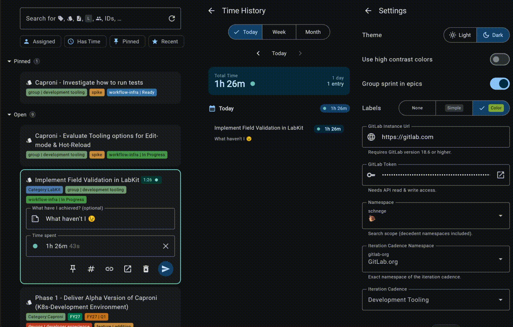

# Time ⏱️

Simplify GitLab time tracking!




**Time** is a frictionless, cross-platform application designed exclusively to make logging time on GitLab a breeze. Stop wrestling with browser tabs, complex nested menus, or manual math. With Time, your current sprint's work items are front and center. Just find your issue, hit start, and let the app handle the rest. Whether you are on your phone, the web, or your desktop, Time keeps your work synced and your focus sharp.

Jump to:
[Project Structure](#Project-Structure) |
[Key Features](#Key-Features) |
[Setup and Configuration](#Setup-and-Configuration) |
[Tech Stack](#Tech-Stack) |
[Build and Run](#Build-and-Run)

**Disclaimer:** _Part of this readme is currently AI generated to save time, it will most likely be revisited at a later point._

## Key Features

* **Seamless GitLab Integration:** Connects directly to your GitLab instance via a Personal Access Token. Select your specific Namespace and Iteration Cadences (Sprints) to automatically load your relevant work.
* **One-Click Tracking:** Swipe right or click to instantly start a timer on any Issue, Task, or Merge Request.
* **Desktop System Tray:** If you are using the Desktop app (macOS/Windows/Linux), a live timer lives right in your system menu bar, so you always know what you're tracking without opening the app.
* **Manual Entry & Adjustments:** Forgot to start the timer? No problem. Easily pause the running timer and manually input your spent time (e.g., "1h 30m") before committing it directly to GitLab.
* **Smart Organization:**
    * **Pinning:** Swipe left to pin high-priority work items to the top of your list.
    * **Quick Filters:** Instantly filter your view by "Assigned to me", "Has Time logged", "Pinned", or "Recently Tracked".
    * **Global Search:** Search across all your work items by title, ID, labels, or assignees.
* **Time History Insights:** View a comprehensive summary of all your logged time, categorized seamlessly into Today, Last Week, or Last Month.
* **Customizable UI:** Supports system Dark/Light modes, toggleable high-contrast color palettes, and customizable label rendering.

## Setup and Configuration

To use Time, you will need to connect it to your GitLab account:
1. Open the app and enter your **GitLab Instance URL** (e.g., `https://gitlab.com`). Requires GitLab version 18.6 or higher.
2. Provide a **Personal Access Token** with `api` read & write access.
3. Select your working **Namespace** and current **Iteration Cadence** to populate your dashboard.

---

## Tech Stack

This is a Kotlin Multiplatform project targeting Android, iOS, Web (Wasm), and Desktop (JVM).
* **UI:** Compose Multiplatform
* **Network & Data:** Apollo GraphQL (with Normalized Caching)
* **Architecture:** Metro DI & Navigation framework
* **Local Storage:** Multiplatform Settings

## Project Structure

This is a Kotlin Multiplatform project targeting Android, iOS, Web, Desktop (JVM).

* [/composeApp](./composeApp/src) is for code that will be shared across your Compose Multiplatform applications.
  It contains several subfolders:
  - [commonMain](./composeApp/src/commonMain/kotlin) is for code that’s common for all targets.
  - Other folders are for Kotlin code that will be compiled for only the platform indicated in the folder name.
    For example, if you want to use Apple’s CoreCrypto for the iOS part of your Kotlin app,
    the [iosMain](./composeApp/src/iosMain/kotlin) folder would be the right place for such calls.
    Similarly, if you want to edit the Desktop (JVM) specific part, the [jvmMain](./composeApp/src/jvmMain/kotlin)
    folder is the appropriate location.

* [/iosApp](./iosApp/iosApp) contains iOS applications. Even if you’re sharing your UI with Compose Multiplatform,
  you need this entry point for your iOS app. This is also where you should add SwiftUI code for your project.

## Build and Run

### Build and Run Android Application

To build and run the development version of the Android app, use the run configuration from the run widget
in your IDE’s toolbar or build it directly from the terminal:
- on macOS/Linux
  ```shell
  ./gradlew :composeApp:assembleDebug
  ```
- on Windows
  ```shell
  .\gradlew.bat :composeApp:assembleDebug
  ```

### Build and Run Desktop (JVM) Application

To build and run the development version of the desktop app, use the run configuration from the run widget
in your IDE’s toolbar or run it directly from the terminal:
- on macOS/Linux
  ```shell
  ./gradlew :composeApp:run
  ```
- on Windows
  ```shell
  .\gradlew.bat :composeApp:run
  ```

### Build and Run Web Application

To build and run the development version of the web app, use the run configuration from the run widget
in your IDE’s toolbar or run it directly from the terminal:
- on macOS/Linux
  ```shell
  ./gradlew :composeApp:wasmJsBrowserDevelopmentRun
  ```
- on Windows
  ```shell
  .\gradlew.bat :composeApp:wasmJsBrowserDevelopmentRun
  ```

### Build and Run iOS Application

To build and run the development version of the iOS app, use the run configuration from the run widget
in your IDE’s toolbar or open the [/iosApp](./iosApp) directory in Xcode and run it from there.

---

Learn more about [Kotlin Multiplatform](https://www.jetbrains.com/help/kotlin-multiplatform-dev/get-started.html),
[Compose Multiplatform](https://github.com/JetBrains/compose-multiplatform/#compose-multiplatform),
[Kotlin/Wasm](https://kotl.in/wasm/)…

We would appreciate your feedback on Compose/Web and Kotlin/Wasm in the public Slack channel [#compose-web](https://slack-chats.kotlinlang.org/c/compose-web).
If you face any issues, please report them on [YouTrack](https://youtrack.jetbrains.com/newIssue?project=CMP).